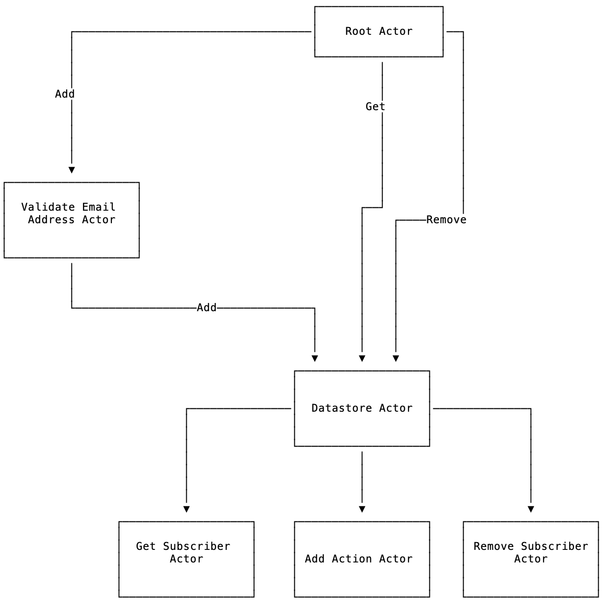

+++
title = "Introduction to Akka Typed Using Scala"
description = "An Introduction to AKKA Typed using Scala with an example"
date = 2020-10-24T20:32:41-07:00

[taxonomies]
tags = ["actor model", "concurrency", "distributed systems", "scala", "akka"]
categories = ["Software Engineering"]

[extra]
social_media_card = "akka_logo.svg"
toc = true
keywords = ["concurrent", "concurrency", "actor model", "actor", "actors", "threads", "petri net", "coroutines", "distributed", "akka", "erlang", "elixir", "akka.net", "microsoft orleans", "orleans", "zio", "zio-actors", "ZIO Actors","swift language actors"]
+++


In this post I am going to do a quick introduction to using the Akka Typed toolkit that implements the Actor model using Scala. As part of this post I will be developing a simple application using Akka. My goal is to highlight what its like to develop applications using Akka and how to get started with it. I will be following up this post with more posts diving into Akka in more details and exploring more of its features and patterns you can use to solve concurrent and distributed applications.

Before reading this post it is recommended that you read my earlier post [Introduction to the Actor Model](/post/introduction-to-the-actor-model/) as I have assumed the reader will be familiar with the concepts discussed in that post.

## Problem to solve ##

To get start we are going to build a simple mailing list application where a persons name and email address are added to a datastore and we are able to retrieve their details and remove them from the datastore. As the scope of this example is to show how we can use Akka to build applications our data store will be a pretend one.

The diagram below illustrates the actors that we will need and the message flow between each actor.



- `Root Actor`: Creates the actor system and spawns all the actors.
- `Validate Email Address Actor`: Validates if the new message received has a valid email address
- `Datastore Actor`: Decides which datastore `Command` (i.e. `Add`, `Get` or `Remove`) we are actioning and calls the relevant actor with the message.
- `Add Action Actor`: Uses the message received to add the received subscriber to the database.
- `Get Subscriber Actor`: Retrieves a subscriber from the database.
- `Remove Subscriber Actor`: Removes a subscriber from the database.

## Messages and Types ##

Lets start by defining the types of the messages our actors are going to be passing.

First our actors are going to be sending on of three types of commands to either add, remove or get a subscriber from the datastore:

```scala
sealed trait Command
final case object Add extends Command
final case object Remove extends Command
final case object Get extends Command
```

The message type to add a subscriber:

```scala
final case class Customer(firstName: String, lastName: String, emailAddress: String)
```

The message type to add a subscriber by the root actor:

```scala
final case class Message(
    firstName: String,
    lastName: String,
    emailAddress: String,
    command: Command,
    db: ActorRef[Message],
    replyTo: ActorRef[SubscribedMessage]
) {
  def isValid: Boolean = EmailValidator.getInstance().isValid(emailAddress)
}
```

This type is identical to the `Customer` type except we are including `ActorRef` for the actors to use to save the subscriber and the actor to use to reply to the caller. The `Message` type also has a property that checks to make sure the received message has a valid email address.

## Validate Email Address Actor ## 

```scala
object Subscriber {

  def apply(): Behavior[Message] = Behaviors.receive { (context, message) =>
    context.log.info(s"Validating ${message.firstName} ${message.lastName} with email ${message.emailAddress}!")
    if (message.isValid) {
      message.replyTo ! SubscribedMessage(1L, context.self)
      message.db ! message
    } else {
      context.log.info(s"Received an invalid message $message.emailAddress")
    }
    Behaviors.same
  }
}
```

When creating actors we need to define how the actor reacts to messages and how they are processed. Looking at the above code you will see that we are creating a `Behavior` which takes a `Message` type. `Behaviors.receive` provides a `context` and the `message` received (which is of type `Message`). 

This actors behavior is:

- It uses `context` to log messages
- The Received `message`'s `isValid` property is used to check if the message contains a valid email and if it does then the actors job is done and it sends a message to two other actors, a reply actor confirming the message has been accepted and a message to the storage actor which saves the message in our datastore. Note that the references to the actors it is going to send a message to is included in the message received. If the message is invalid, an appropriate message is logged and no further action is taken.
- Lastly, `Behaviors.same` is called to indicate to the system to reuse the previous actor behavior for the next message. For more information about the different behaviors you can return visit [Behaviors API Docs](https://doc.akka.io/api/akka/current/akka/actor/typed/scaladsl/Behaviors$.html)

## Datastore Actor ##

This actor is responsible for adding, removing and fetching a `Customer` from the datastore.

```scala
object Datastore {
  def apply(): Behavior[Message] = Behaviors.receive { (context, message) =>
    context.log.info(s"Adding ${message.firstName} ${message.lastName} with email ${message.emailAddress}!")
    message.command match {
      case Add => println(s"Adding message with email: ${message.emailAddress}") // Send message to Add Action Actor
      case Remove => println(s"Removing message with email: ${message.emailAddress}") // Send message to Remove Subscriber Actor
      case Get => println(s"Getting message with email: ${message.emailAddress}") // Send message to Get Subscriber Actor
    }
    Behaviors.same
  }
}
```

The `Message` received contains a `Command`, the behavior defined for this actor is to use pattern matching to determine and `Add` to the datastore, `Remove` from the datastore or to `Get` from the datastore. The appropriate message is sent to the actor that will carry out the action as illustrated in my diagram and code snippet above.

The resulting behavior for this actor is also `Behaviors.same` as it is not changing in any way and its behavior will be the same all the time.

## Creating the Actor System ##

```scala
object ActorsMain {
  def apply(): Behavior[Customer] =
    Behaviors.setup { context =>
      val subscriber = context.spawn(Subscriber(), "subscriber")
      val db = context.spawn(Datastore(), "db")

      Behaviors.receiveMessage { message =>
      	val replyTo = context.spawn(Reply(), "reply")
        subscriber ! Message(message.firstName,message.lastName,message.emailAddress,Add,db,replyTo)
        Behaviors.same
      }
    }
}

object Pat extends App {
  val actorsMain: ActorSystem[Customer] = ActorSystem(ActorsMain(), "PatSystem")
  actorsMain ! Customer("Salar", "Rahmanian", "code@softinio.com")
}
```

The root actor spawns all the new actors and as a result has the `ActorRef` for all the actors.

Looking at the above code snippet you can see that we are creating a `Behavior` of type `Customer`, which is the type of the message we are going to receive. As this is the outer most actor in our actor hierachy, `Behaviors.setup` is used to spawn all the actors we have. When a new message is received, a message is sent to the subscriber actor (which is our validate email address actor).

In the applications `main` (i.e. `Pat` object), we create the `ActorSystem` and start sending `Customer` messages.

## Summary ##

In this post I have just tried to give you a feel for what its like to use akka, how to think about your application in terms of Actors and message passing and to get started. Akka offers a lot of awesome features so stay tuned and follow my blog as we explore and learn about akka. You can look at the application we discussed in this post [here on GitHub](https://github.com/softinio/pat).


## Useful Resources ##

- [My Sample Application used in this post](https://github.com/softinio/pat)
- [Akka Documentation](https://akka.io/docs/)
- [Conference talk introducing Akka Typed](https://www.youtube.com/watch?v=Qb9Cnii-34c)
- [Typecasting Actors: from Akka to TAkka](http://lampwww.epfl.ch/~hmiller/scala2014/proceedings/p23-he.pdf)
