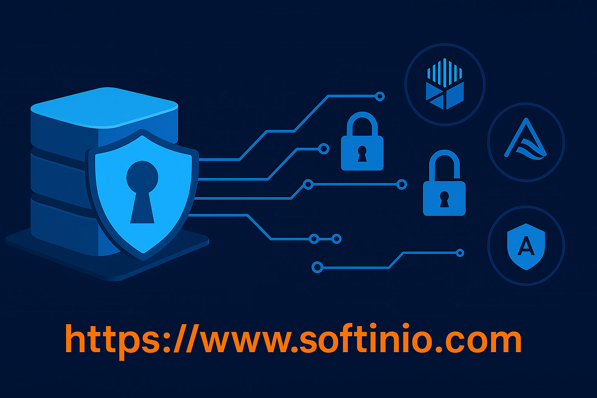
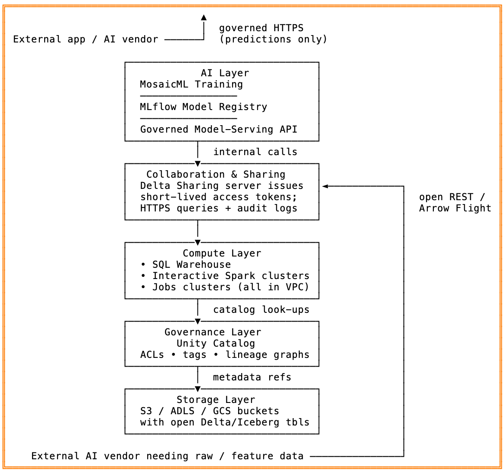

+++
title = "The Data Surrender Trap: How Enterprises Are Losing Control in the AI Gold Rush—and the Simple Fix"
description = "Avoid the data-surrender trap: keep data in-place with open standards and governance, share securely, and bring AI to your data—not the other way around. "
date = 2025-04-26T18:07:52-08:00

[taxonomies]
tags = ["AI", "Data Governance", "Data Engineering", "Artificial Intelligence"]
categories = ["Data Engineering", "Artificial Intelligence", "Data Governance"]

[extra]
social_media_card = "TheDataSurrenderTrap.svg"
toc = true
keywords = ["AI", "Databricks", "Data Governance", "Data Engineering", "Artificial Intelligence", "Data Surrender Trap", "Data Sharing", "Data Security", "Data Privacy", "Open Standards", "Zero-Copy Sharing", "Google Cloud", "AWS", "Microsoft Azure", "Snowflake", "Data Residency", "Data Compliance", "Data Strategy", "Iceberg", "Delta Lake", "Apache Ranger", "Open Policy Agent", "Unity Catalog", "Data Lineage", "Data Sharing Protocols", "MosaicML", "Model Serving", "Data Architecture", "DuckDB", "Lakekeeper"]
+++

Generative AI has lit a fire under every product road-map. Faced with “ship it yesterday” pressure, many teams reach for a turnkey vendor: upload data, call an API, launch the feature. It works—until the bill comes due.

Handing raw customer data to a third party introduces two long-term headaches:

1. Governance and compliance risk – once data leaves your perimeter, you lose direct control over how long it's stored, where it resides, and who can see it. A single mis-configuration or model-training clause could violate GDPR, HIPAA, or internal policy.
2. Technical debt – the day you need to swap providers, migrate regions, or delete a customer record, you discover tight coupling in schemas, pipelines, and security controls that were never designed for portability.
3. Technical debt - having to synchronize data between multiple vendors and your own systems, which can lead to data inconsistencies and increased complexity.

## Best practices: bring the AI to the data, not the data to the AI

Enterprise architects have converged on four guard-rails for safe, future-proof AI:

| Guard-rail | Why it matters | Practical test |
| --- | --- | --- |
| Open, in-place storage | Avoid proprietary traps; support multi-cloud or on-prem moves | “If the vendor disappeared tomorrow, could I still read my data in Parquet/Delta/Iceberg?” |
| Unified governance layer | Single set of fine-grained permissions, lineage, and audit logs | “Can I give a partner read-only access to one column and see every query they run?” |
| Zero-copy sharing | Eliminate fragile CSV exports; revoke access instantly | “When a collaboration ends, can I cut off data without chasing down replicas?” |
| Integrated model lifecycle | Training, registry, and serving inside the governed perimeter | “Can I trace every prediction back to its training dataset and code commit?” |

Platforms that deliver all four let you innovate quickly and satisfy CISOs and regulators.

## Open Standards — Give AI Strict Access Without Handing Over the keys

Before we look at any vendor implementation, it helps to know the building-block standards that let you:

- keep data right where it is
- yet expose just enough for analytics or AI

| Layer | Open standard | Why it matters |
| --- | --- | --- |
| Table formats | Apache Iceberg, Delta Lake, Apache Hudi, Parquet | Column-oriented, ACID-capable tables that sit in ordinary cloud storage and are readable by engines like Spark, Trino, Flink, etc. Iceberg's spec is fully open, so any vendor can implement it—preventing lock-in and enabling multi-cloud lakes. |
| Governance / access control | Apache Ranger, Open Policy Agent, Unity Catalog, Lakekeeper | Centralize table/row/column policies, data masking, and audit logs across dozens of engines and clouds—without embedding rules in every service. Ranger policies even support dynamic row-level filters. |
| Data lineage | OpenLineage | A vendor-neutral API for emitting and collecting lineage events from Spark, Airflow, dbt, BigQuery, and more. Lets you trace every model back to the exact inputs that produced it. |
| Zero-copy data sharing | Delta Sharing (REST), Iceberg REST Catalog, Arrow Flight SQL | Instead of emailing CSVs, expose live tables through open protocols. Recipients query directly—Spark, Pandas, BI tools—while you keep full revocation and audit control. Delta Sharing is the first open REST protocol for this purpose; Iceberg's REST catalog spec and Arrow Flight do the same for metadata and high-speed transport. |

What this unlocks:

- **Bring compute to data**. Spin up Spark, DuckDB, or an LLM fine-tuning job inside the VPC that owns the storage, using the open format directly. No data export required.
- **Share surgically**. Grant a vendor or partner a token that exposes only the columns or partitions they need, over an open protocol you can turn off instantly.
- **Stay future-proof.** Because storage and governance are defined by community specs, you can mix-and-match clouds or engines without rewriting pipelines.

With these open standards in place, any platform that respects them can satisfy the four guard-rails—open storage, unified governance, zero-copy sharing, in-platform ML.

## Databricks: the platform that delivers all four guard-rails

Databricks' Lakehouse architecture assembles the pieces in one stack:

- **Delta Lake** – Open-source ACID tables on cloud object storage. You keep data in your S3/ADLS/GCS buckets; Databricks adds versioning, upserts, and time-travel without changing file formats.
- **Unity Catalog** – A multicloud metastore that applies table/row/column permissions, tags, and audit logs across SQL, Python, BI dashboards, and ML pipelines. Governance once, enforced everywhere.
- **Delta Sharing** – The first open protocol for zero-copy sharing. Providers grant token-based access to live tables; recipients query in Spark, Pandas, Power BI, or even Snowflake without relocating data. Access is revocable in seconds.
- **MosaicML + Databricks Model Serving** – High-efficiency training and hosting of LLMs inside the Lakehouse. You fine-tune open-source or foundation models on proprietary data that never leaves your cloud account, then expose a governed HTTPS endpoint. All lineage (data → model → endpoint) is captured in Unity Catalog.

Because compute clusters run inside your VPC, and storage stays in your buckets, data residency and encryption standards remain under your control. The Lakehouse “brings compute to data,” satisfying the four guard-rails by design.

If you are already using Databricks for your data engineering needs, you are in safe hands, leverage these features for the greater good of your data strategy.

## How the other majors compare—neutral and concise

| Area | Databricks | AWS | Google Cloud | Microsoft Azure | Snowflake |
| --- | --- | --- | --- | --- | --- |
| Open table format | Delta Lake (native) | Iceberg & Hudi support via Glue | BigLake now queries Delta & Iceberg | Delta via Synapse Spark | Native storage is proprietary; external tables support Iceberg/Delta |
| Central governance | Unity Catalog | Lake Formation + Glue Catalog | Dataplex + BigLake | Purview | Object tagging, masking policies |
| Zero-copy sharing | Open Delta Sharing (any tool) | Cross-account Lake Formation permissions; Data Exchange | BigQuery authorized views; BigLake metadata | Azure Data Share (Azure-only) | Snowflake Secure Data Sharing (Snowflake-only) |
| In-platform ML | Spark ML + MosaicML + Serving | SageMaker (integrated with Lake Formation) | Vertex AI (ties to BigQuery/BigLake) | Azure ML (ties to Synapse/ADLS) | Snowpark ML + Model Registry |
| Control plane | Runs in vendor account; data plane in your VPC | All in AWS | All in Google Cloud | All in Azure | Managed by Snowflake (still in your cloud region) |

Key take-aways:

- Every provider now markets a “lakehouse” story; the difference is openness and ecosystem lock-in.
- AWS, Google, and Azure each solve the problem well inside their cloud. Multi-cloud or future migration can be harder.
- Snowflake excels at instant sharing inside its service but requires you to load data into Snowflake storage (or at least pay Snowflake to query external tables).
- Databricks' bet is that open formats + open sharing + multi-cloud governance reduce long-term friction.
- Google Cloud's BigLake provides external connection to Delta Lake and Iceberg

## Architecture snapshot for engineers and data scientists

- External AI vendors have two strictly-controlled entry points
- Model-Serving API (top) They can request predictions from your governed endpoint—no direct data access required.
- Delta Sharing (middle-right) If a vendor truly needs training or feature data, you grant a scoped, revocable token that exposes only the tables/columns you approve.

All other layers—compute, governance, storage—live inside your VPC / cloud account, so raw data never leaves your perimeter unless you explicitly share it through the Delta Sharing gateway.

## Putting It into Practice – an Up-to-Date Migration & Safe-Sharing Playbook

Each step below tightens control, reduces copies, and shows how to give an external AI vendor only the data they truly need—without falling into the data-surrender trap.

| Step | Action | Why / Tips |
| --- | --- | --- |
| Inventory & classify | <ul><li>Tag PII, payment data, trade secrets, regulated logs.</li><li>Record legal basis (GDPR, HIPAA, SOC-2 scope, etc.).</li></ul> | You can't apply least-privilege sharing if you don't know what's sensitive. |
| Land everything in open, governed tables | <ul><li>Convert CSV/Parquet to Delta / Iceberg with schema enforcement & time-travel.</li><li>Store in your S3 buckets / Google Cloud Storage; enable server-side encryption and object-lock.</li></ul> | Open formats + immutable history make later audits and deletions possible. |
| Switch on a unified catalog | <ul><li>Unity Catalog / Lake Formation / Purview / Dataplex / Lakekeeper.</li><li>Import IAM groups, apply column masks, row filters, dynamic data tags (“pii = true”).</li></ul> | One policy engine ≫ dozens of per-tool ACLs. |
| Harden the perimeter | <ul><li>Private subnets, VPC peering, and storage firewall rules so only approved compute can touch raw data.</li><li>Disable public buckets & open egress unless justified.</li></ul> | Keeps “shadow ETL” from copying data out the side door. |
| Safely share with an external AI vendor (zero-copy) | <ol><li>Minimise first – aggregate, pseudonymise, or drop columns the vendor doesn't need.</li><li>Create a Share (Delta Sharing / Iceberg REST / Arrow Flight):  <ul><li>Grant only the filtered table or view.</li><li>Attach row-level filters & column masks.</li><li>Issue a time-boxed bearer token (7-, 30-, or 90-day TTL) and pin it to the vendor's IP range. Databricks DocumentationDatabricks</li></ul><li>Contract & controls – DPA, usage policy, no onward sharing.</li><li>Monitor – streaming audit of every query; set alerts for unusually large scans.</li><li>Revoke or rotate the token the moment the engagement ends (one CLI/API call).</li></ol> | Zero-copy protocols let the vendor query live tables without replicating them. Instant revocation closes the door the second you're done. |
| Move internal ML pipelines onto the platform | <ul><li>Use Spark + MosaicML (or SageMaker/Vertex/Azure ML) inside the governed workspace.</li><li>Log models to a central registry; tag each with source-data lineage.</li></ul> | No more exporting giant CSVs to Jupyter on someone's laptop. |
| Expose governed model endpoints | <ul><li>Deploy behind Model Serving (or cloud equivalent).</li><li>Protect with catalog-level ACLs, network policies, and request logging.</li></ul> | External apps can call for predictions without direct data access. |
| Automate audits & drift detection | <ul><li>Scheduled jobs that flag:  – Tables without tags / owners  – Shares approaching token expiry  – Models trained on untagged data</li><li>Pipe findings to Slack / JIRA for triage.</li></ul> | Governance-as-code keeps guard-rails from eroding over time. |

**Result**: engineers still use the notebooks, SQL editors, and BI dashboards they love—but every byte of sensitive data stays in your buckets, under traceable, revocable control. External AI vendors get exactly the slice you permit, for exactly as long as you permit, with a full audit trail to keep everyone honest.

## Conclusion – Bring AI to Your Data and Future-Proof the Business

The AI race rewards the companies that can move fast without surrendering their crown-jewel data. The way to do that is simple—but non-negotiable:

- **Keep data where it lives** in your own cloud buckets or data centers.
- **Wrap it in open standards**—Delta, Iceberg, Parquet, Ranger, OpenLineage, zero-copy sharing protocols—so any engine or vendor can work with it, and you can walk away at any time.
- **Follow a disciplined playbook:** classify → convert → govern → harden → share surgically → train in-place → serve under guard → audit continuously.

Do those three things and you flip the script: instead of pushing raw tables out to a black-box vendor, you invite algorithms, fine-tuning jobs, and BI tools into a tightly controlled environment. The result is faster experimentation (no week-long data exports), fewer compliance nightmares (every read is logged and revocable), and zero re-platform tax when the next cloud, model, or regulation arrives.

In short, **bringing AI to your data—under open, governed standards—isn't just best practice; it's the only sustainable data strategy for the decade ahead.** Adopt it now, and each new AI breakthrough becomes an easy plugin rather than a risky migration. Your teams keep innovating, your security team keeps sleeping, and your customers keep trusting you with their data.
