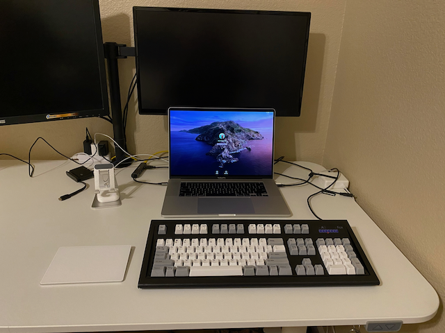
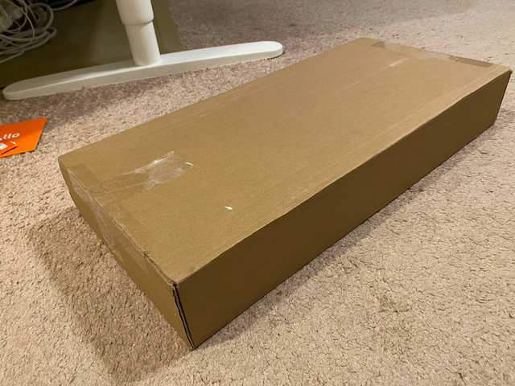
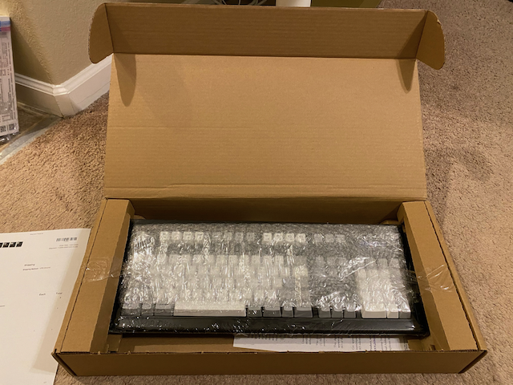
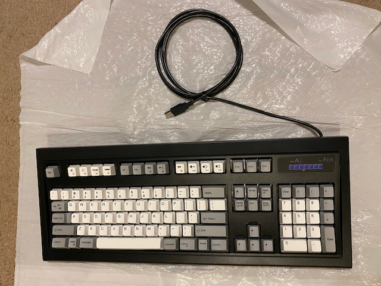

+++
title = "Unicomp New Model M Keyboard"
description = "Unicomp new Model M keyboard is the latest version of the classic and fabulous IBM Model M keyboard that came out earlier this year. This blog post is my unboxing and review of this timeless keyboard."
date = 2020-12-18T20:08:42-08:00

[taxonomies]
tags = ["keyboards"]
categories = ["Hardware"]

[extra]
social_media_card = "unicomp_new_model_m.png"
toc = true
keywords = ["keyboard", "keyboards", "mechanical keyboards", "buckling spring", "buckling spring keyboard", "ibm model m", "ibm keyboard", "unicomp", "unicomp model m", "unicomp new model m", "unicomp new model m keyboard", "model m"]
+++

Unicomp new Model M keyboard is the latest version of the classic and fabulous IBM Model M keyboard that came out earlier this year. This blog post is my unboxing and review of this timeless keyboard.

My favorite keyboard of all time was the [IBM Model M keyboard](https://en.wikipedia.org/wiki/Model_M_keyboard). Through out the 1980s and the 1990s I would exclusively use this keyboard. In fact as I type this blog post I can confirm I still have 3 of them in my garage back in London, England.

Ever since I moved to the USA, both at work and at home I have been using various keyboards by Apple. Though I have nothing bad to say about the Apple keyboards, after all they are cosmetically pleasing, of high build quality and work really well with all things Apple, I started really missing my IBM Model M. This is when I found out Unicomp have released a new Model M and I decided to buy one.

## Who are Unicomp?

When IBM decided to stop manufacturing keyboards, a company called Lexmark bought their equipment and all rights to their keyboards and continued making them. In turn Lexmark stopped manufacturing keyboards too and at that point some ex-IBM and ex-Lexmark staff got together, purchased all the manufacturing equipment and rights to continue manufacturing the keyboards (but of course without the IBM and Lexmark branding) and setup a new company called `Unicomp`. [Unicomp](https://www.pckeyboard.com/) has since continued producing these keyboards for like the last 25 years.

## Unboxing

This is how it was delivered:

When the package arrived I could feel the keyboard moving inside the box, but when I opened the box I saw how well it was packed:

I took it out of its box and removed all packaging material it was wrapped in:

## Review

As I looked at the keyboard, before taking it out of the box, I could immediately tell it was a Model M and its evolution. Super excited and impatient I took it out of the box. My first observation was that it comes with a USB (standard not USB-C) cable that is not removable. It felt lighter in weight than the original IBM Model M I had. Next I looked at its build quality and was overall impressed. The original IBM Model M does feel more robust but I could not fault this new Model M. All this was to be expected though, as I didn't have my expectation set to receiving a keyboard that is made by 100% the same materials as the original Model M I had. 

Having one of the newer macbooks with only USB-C ports, I set my new keyboard on my desk and plugged it in via a USB adapter and off I went looking for excuses to type so I can use my new keyboard.

I am thoroughly enjoying using this keyboard. Its typing feel and size are on par with the original Model M I had. I had forgotten how much more comfortable it is to type on Model M than an Apple keyboard. Comparing now, I can see that my hands are too big for the Apple keyboards so I would try to type in a cramped space to fit my hands in, as opposed to this Model M which is perfect for my hand size. This alone has resulted in me being able type faster, be more comfortable and make virtually no typing mistakes. As always I find the higher actuation point feel and the audible feedback the sound provided by the buckling springs with each keystroke incredibly pleasing. Comparing the sound of the buckling springs with the original IBM Model M, I would say the new Unicomp Model M is slightly quieter.

### How well does it work with macOS

When I went to place my order on Unicomp website they only had a windows version of the new Model M listed. Whilst that will work fine with macOS, it does have some features missing compared to a keyboard that has dedicated support for macOS, such as volume control, music play/stop/previous track /next track keys. Good news is I called Unicomp and spoke to Troy about this and he was kind enought to tell me I can place an order and request a custom configuration at a small fee to have the extra macOS features added. I did that and my keyboard has all the extra macOS keys functioning as expected. It even has the window key replaced with the macOS command key. 

### Unicomp quality of service

When you first visit Unicomp website, you get the sense that you just visited a website from 20 years ago with not the best user experience browsing or ordering. When you research Unicomp on the internet you won't find much activity on social media or any form of marketing.

Please do not be put off by this and don't judge them because of their dated look. The quality of service I received is one of the best I have ever received. When I called to find out more about the New Model M not only was the help I received exemplarity, but once I placed my order, even though it had the custom configuration of macOS support added was shipped within 24 hours of placing the order and the item received is fantastic in every possible way.

## Conclusion

I am back again reunited with my old friend a Model M. I am enjoying using it so much after a gap of not having one that I am looking for excuses to use it more and more. So expect more [blogs](https://www.softinio.com) and [newsletters](https://notes.softinio.com) from me going forward, as this keyboard is a joy to use. 

## References

- [Link to Unicomp Model M that I ordered](https://www.pckeyboard.com/page/product/NEW_M)
