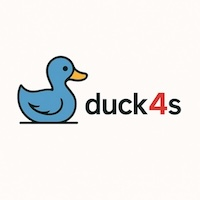

+++
title = "duck4s"
description = "A modern, type-safe Scala 3 wrapper library for DuckDB."
weight = 3

[taxonomies]
tags = ["Scala", "DuckDB", "Database", "Project"]
categories = ["Project"]

[extra]
local_image = "projects/duck4s/duck4s_logo.jpeg"
social_media_card = "duck4s_logo.jpeg"
toc = true
keywords = ["Scala", "DuckDB", "Database"]
+++

# Overview

A modern, type-safe Scala 3 wrapper library for DuckDB that provides idiomatic, functional programming-friendly access to DuckDB's analytical database capabilities through its Java JDBC client.

## Links

- Repository: <https://github.com/softinio/duck4s>
  - README: <https://github.com/softinio/duck4s/blob/main/README.md>
