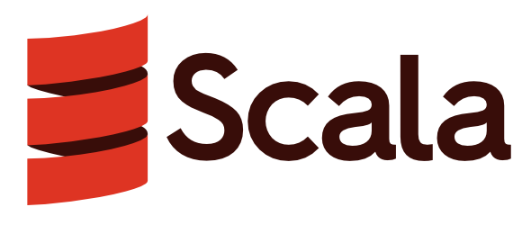

+++
title = "scaladex.nvim"
description = "Lua Library and Neovim Plugin to search scaladex for scala packages."
weight = 2

[taxonomies]
tags = ["Scala", "lua", "neovim"]
categories = ["Project"]

[extra]
local_image = "projects/scaladex-nvim/scala-logo.png"
social_media_card = "scala-logo.png"
toc = true
keywords = ["Scala", "neovim", "lua", "telescope", "scaladex"]
+++

# Overview

I created a lua library that is able to search for scala pages on [Scaladex](https://index.scala-lang.org).

I then used it to create a [Neovim](https://neovim.io) plugin and [telescope.nvim](https://github.com/nvim-telescope/telescope.nvim) plugin so that when I am coding using Neovim I can search for and add packages as dependencies.

## Demo and Video Tutorial on using scaladex.nvim

{{ peertube(id="44bD8ASpSkzmKifDBNMBkr") }}

## Links

- Repository: <https://github.com/softinio/scaladex.nvim>
  - README: <https://github.com/softinio/scaladex.nvim/blob/main/README.md>

