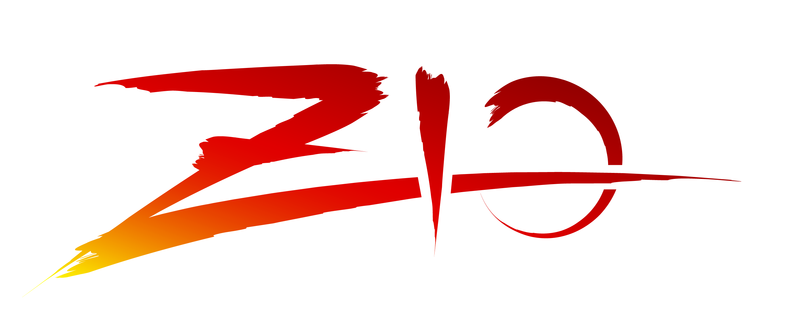

+++
title = "ZIO Actors"
description = "A High performance, purely functional library for building, composing, and supervising typed actors based on ZIO using Scala."
weight = 4

[taxonomies]
tags = ["actor model", "concurrency", "distributed systems", "scala", "functional programming", "zio"]
categories = ["Project"]

[extra]
local_image = "projects/zio-actors/ZIO.png"
social_media_card = "ZIO.png"
toc = true
keywords = ["concurrent", "concurrency", "actor model", "actor", "actors", "threads", "petri net", "coroutines", "distributed", "akka", "erlang", "elixir", "akka.net", "microsoft orleans", "orleans", "zio", "zio-actors", "zio actors","swift language actors", "functional programming", "fp"]
+++

# Overview

ZIO Actors is a high-performance, purely functional library for building, composing, and supervising typed actors based on ZIO using Scala.

Original creator of this project, though I do not maintain it anymore.

## My blog post and Talk about ZIO Actors

[see here](/talks/acting-lessons-for-scala-engineers-with-akka-and-zio/)

## Links

- Repository: <https://github.com/zio/zio-actors>
  - README: <https://github.com/zio/zio-actors/blob/master/README.md>
- Documentation: <https://zio.dev/zio-actors/>
