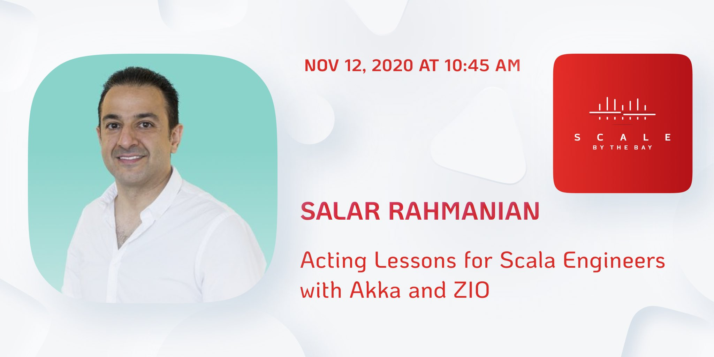

+++
title = "Acting Lessons for Scala Engineers With Akka and Zio"
description = "Salar Rahmanian's talk at Scale By the Bay conference 2020 on Akka Actors and ZIO Actors"
date = 2021-04-10T10:20:09-07:00
weight = 3

[taxonomies]
tags = ["actor model", "concurrency", "distributed systems", "scala", "functional programming", "conference", "talks"]
categories = ["Talks"]

[extra]
local_image = "talks/acting-lessons-for-scala-engineers-with-akka-and-zio/sbtb2020.webp"
social_media_card = "sbtb2020.jpg"
toc = true
keywords = ["concurrent", "concurrency", "actor model", "actor", "actors", "threads", "petri net", "coroutines", "distributed", "akka", "erlang", "elixir", "akka.net", "microsoft orleans", "orleans", "zio", "zio-actors", "zio actors","swift language actors", "functional programming", "fp", "tech talk", "talk", "conference", "scale by the bay", "scala by the bay", "by the bay", "functional.tv", "sf scala"]
+++

In November 2020 I had the great privilege to do a [Talk at Scale By The Bay Conference](https://scalebythebay2020.sched.com/event/e54O/acting-lessons-for-scala-engineers-with-akka-and-zio).

### Recording of my talk

{{ youtube(id="AQXBlbkf9wc") }}

### Slides

Slides for my talk can be found [here](https://github.com/softinio/talks/blob/master/SBTB2020/acting-lessons-for-scala-engineers-with-akka-and-zio.pdf).

### I also wrote three blogs posts as a companion to my talk

[Introduction to the Actor Model](https://www.softinio.com/post/introduction-to-the-actor-model/)

[Introduction to Akka Typed Using Scala](https://www.softinio.com/post/introduction-to-akka-typed-using-scala/)

[Introduction to Zio Actors](https://www.softinio.com/post/introduction-to-zio-actors/)

