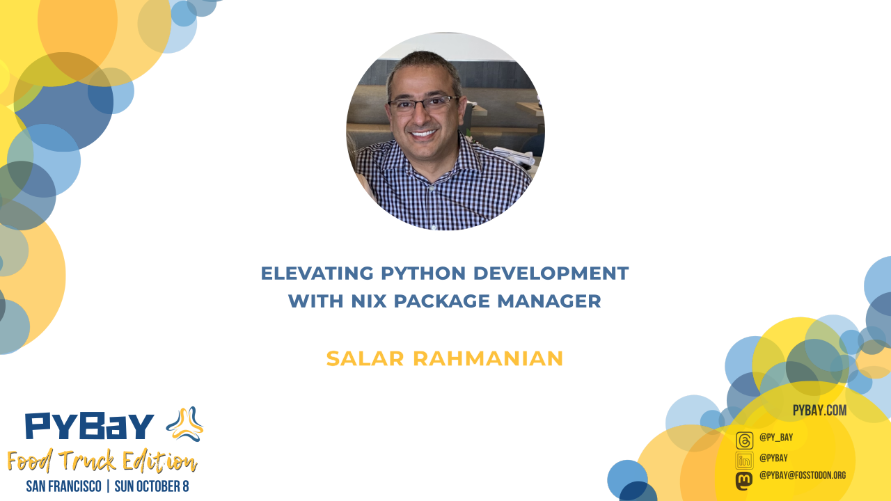

+++
title = "Elevating Python Development with Nix Package Manager"
description = "Salar Rahmanian's talk at PyBay 2023"
date = 2023-10-14
weight = 2

[taxonomies]
tags = ["Nix", "NixOS", "Python", "functional programming", "conference", "talks"]
categories = ["Talks"]

[extra]
local_image = "talks/elevating-python-development-with-nix/Elevating_Python_Development_with_Nix_Package_Manager.png"
social_media_card = "Elevating_Python_Development_with_Nix_Package_Manager.png"
toc = true
keywords = ["Nix", "NixOS", "Python", "devenv", "flakes", "functional programming", "fp", "tech talk", "talk", "conference", "PyBay", "SF Python", "sfpython"]
+++

In October 2023 I had the great privilege to do a talk at PyBay 2023 in San Francisco, California.

### Recording of my talk

{{ youtube(id="AJs_izrEBOA") }}

### Slides

Slides for my talk can be found [here](https://github.com/softinio/talks/blob/master/PyBay2023/pybay2023_slides.pdf).

