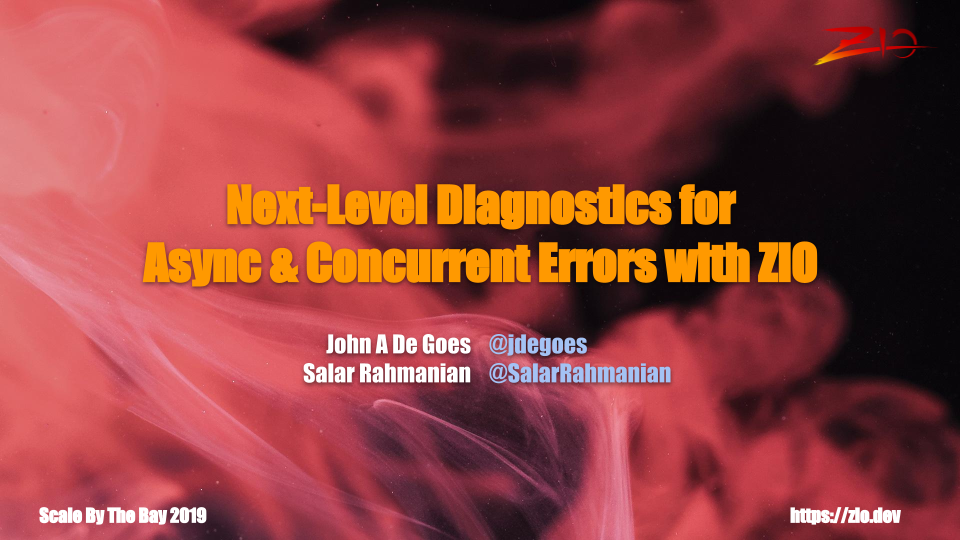

+++
title = "Next-Level Diagnostics for Async & Concurrent Errors with ZIO"
description = "Salar Rahmanian's talk with John A De Goes at Scale By The Bay 2019"
date = 2019-11-13
weight = 4

[taxonomies]
tags = ["concurrency", "distributed systems", "scala", "functional programming", "conference", "talks", "ZIO"]
categories = ["Talks"]

[extra]
local_image = "talks/next-level-diagnostics-for-async-and-concurrent-errors-with-zio/sbtb2019.png"
social_media_card = "sbtb2019.png"
toc = true
keywords = ["concurrent", "concurrency", "coroutines", "distributed", "zio", "functional programming", "fp", "tech talk", "talk", "conference", "scale by the bay", "scala by the bay", "by the bay", "functional.tv", "sf scala"]
+++

In November 2019 I had the great privilege to do a [Talk at Scale By The Bay Conference](https://scalebythebay2019.sched.com/event/RoSt/next-level-diagnostics-for-async-concurrent-errors-with-zio) with John A De Goes.

### Recording of my talk

{{ youtube(id="MdYKEwuWR4U") }}

### Slides

Slides for my talk can be found [here](slides.pdf).

