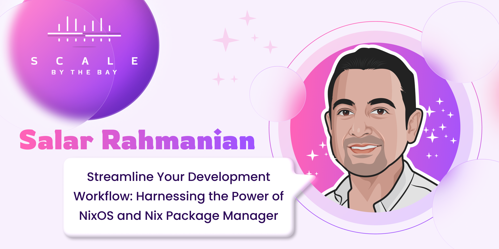

+++
title = "Streamline Your Development Workflow: Harnessing the Power of NixOS and Nix Package"
description = "Salar Rahmanian's talk at Scale By The Bay 2023"
date = 2023-10-14
weight = 1

[taxonomies]
tags = ["Nix", "NixOS", "Python", "functional programming", "conference", "talks"]
categories = ["Talks"]

[extra]
local_image = "talks/streamline-your-development-workflow/sbtb2023.png"
social_media_card = "sbtb2023.png"
toc = true
keywords = ["Nix", "NixOS", "Python", "devenv", "flakes", "functional programming", "fp", "tech talk", "talk", "conference", "scale by the bay", "scala by the bay", "by the bay", "functional.tv", "sf scala"]
+++

In November 2023 I had the great privilege to do a talk at [Scale By The Bay 2023](https://www.scale.bythebay.io/post/salar-rahmanian-streamline-your-development-workflow-harnessing-the-power-of-nixos-and-nix-package) in San Francisco, California.

### Recording of my talk

{{ youtube(id="Qv3Y23RjJa0") }}

### Pre-Conference Introduction to talk

{{ youtube(id="LVadoYGDvI8") }}

### Post Conference Interview

{{ youtube(id="B9wpkWdE368") }}

### Slides

Slides for my talk can be found [here](https://github.com/softinio/talks/blob/master/SBTB2023/sbtb2023_slides.pdf).

